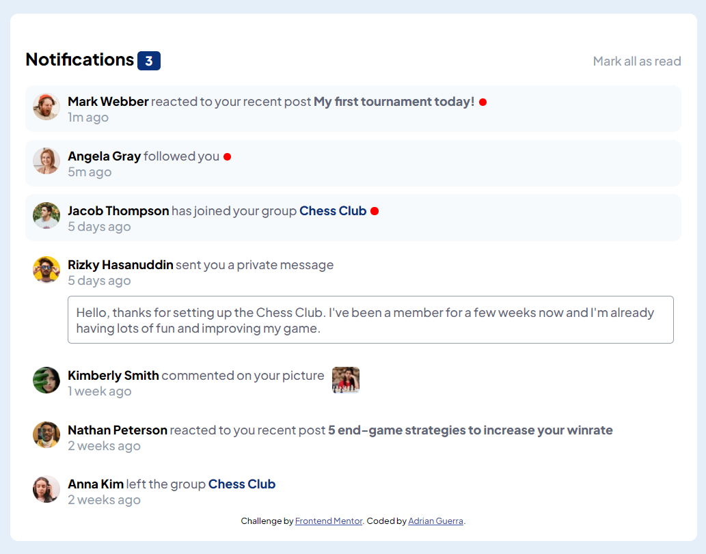

# Frontend Mentor - Notifications page solution

This is a solution to the [Notifications page challenge on Frontend Mentor](https://www.frontendmentor.io/challenges/notifications-page-DqK5QAmKbC). Frontend Mentor challenges help you improve your coding skills by building realistic projects. 

## Table of contents

- [Overview](#overview)
  - [The challenge](#the-challenge)
  - [Screenshot](#screenshot)
  - [Links](#links)
- [My process](#my-process)
  - [Built with](#built-with)
  - [What I learned](#what-i-learned)
  - [Continued development](#continued-development)
- [Author](#author)


## Overview

### The challenge

Users should be able to:

- Distinguish between "unread" and "read" notifications
- Select "Mark all as read" to toggle the visual state of the unread notifications and set the number of unread messages to zero
- View the optimal layout for the interface depending on their device's screen size
- See hover and focus states for all interactive elements on the page

### Screenshot




### Links

- Solution URL: [Add solution URL here](https://your-solution-url.com)
- Live Site URL: [https://notifications-page-mocha.vercel.app/](https://notifications-page-mocha.vercel.app/)

## My process

### Built with

- Semantic HTML5 markup
- CSS custom properties
- Flexbox
- Mobile-first workflow
- [React](https://reactjs.org/) - JS library


### What I learned

I learned more about useState and how to change the state of certain aspects of the page.


```jsx
function Header({isUnread, setIsUnread, notiAmount, setAmount}) {
    function toggle() {
        setIsUnread(!isUnread);
        if (isUnread) {
            setAmount(0);
        } else {
            setAmount(3);
        }
    }

    return (
        <section className="header-container">
            <h1>Notifications <span className="noti-amount">{notiAmount}</span></h1>
            <a className="mark-read" onClick={toggle}>Mark all as read</a>
        </section>
    )
}
```
In the above code, I toggle between read and unread states, and change the notification amount value based on the current state.

### Continued development

In this project, I've gained some more practice with the useState hook. I'm sure there was a more practical way to implement the "Mark all as read" portion of the code, but I worked with what I knew. The reuse of the notification component also came in handy. Although I didn't use a database, I can already see how valuable reusable components are when it comes to working with them.


## Author

- LinkedIn - [Adrian Guerra](https://www.linkedin.com/in/adrian-guerra-a210a4196/)
- Frontend Mentor - [@adie9](https://www.frontendmentor.io/profile/adie9)


